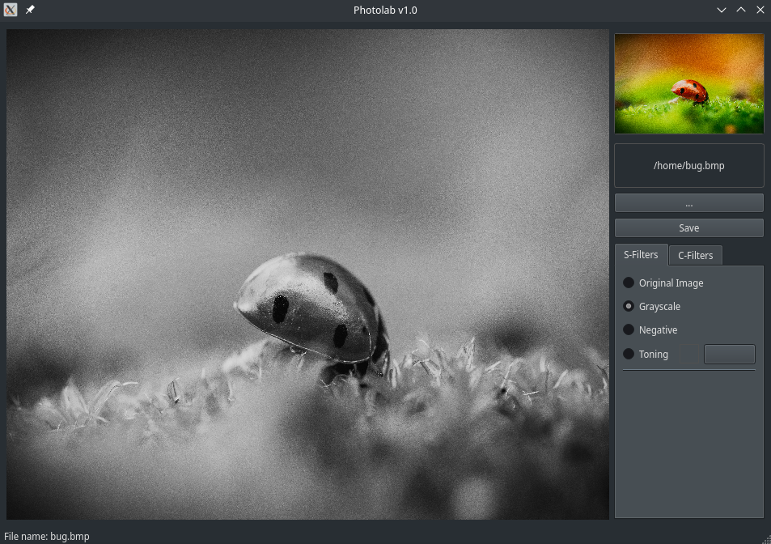

# PhotoLab

В проекте реализовано приложение для наложения различных фильтров свертки на изображение. Такие фильтры используются для размытия изображения, повышения четкости, контурирования, создания эффекта барельефа и наложения многих других различных эффектов

## Описание

- Программа разработана на языке С++ стандарта C++17 с использованием компилятора g++
- Программа реализована с использованием паттерна MVC 
- Код программы находится в папке src 
- Сборка программы настроена с помощью Makefile со стандартным набором целей для GNU-программ: all, install, uninstall, clean, dvi, dist, test, gcov_report. Установка производится в каталог Maze/build
- Программа разработана в парадигме объектно-ориентированного программирования
- Обеспечено покрытие unit-тестами модулей, связанных с вычислением выражений, с помощью библиотеки GTest
- Графический пользовательский интерфейс реализован на базе Qt
- Средство автоматизации сборки CMake

## Функционал

- Программа предоставляет возможность:
    - загружать произвольное изображение формата BMP
    - сохранить результат фильтрации в отдельный файл (формат BMP)
    - применить фильтр из пула готовых фильтров:
        - Обесцвечивание (без использования свертки)
        - Негатив (без использования свертки)
        - Тонирование (по аналогии с обесцвечиванием, но в оттенках указанного на палитре цвета)
    - применять на изображение следующие фильтры свертки:
        - Барельеф (Emboss)
        - Повышение резкости (Sharpen)
        - Блочное размытие (Box blur)
        - Гауссово размытие (Gaussian blur)
        - Фильтр Лапласа (Laplacian filter)
        - Фильтр Собеля (Sobel filter)
    - вводить произвольную матрицу ядра фильтра (размером до 17x17) вручную через отдельное диалоговое окно
- После применения фильтрации результат должен быть отображен в пользовательском интерфейсе вместе с исходным изображением
